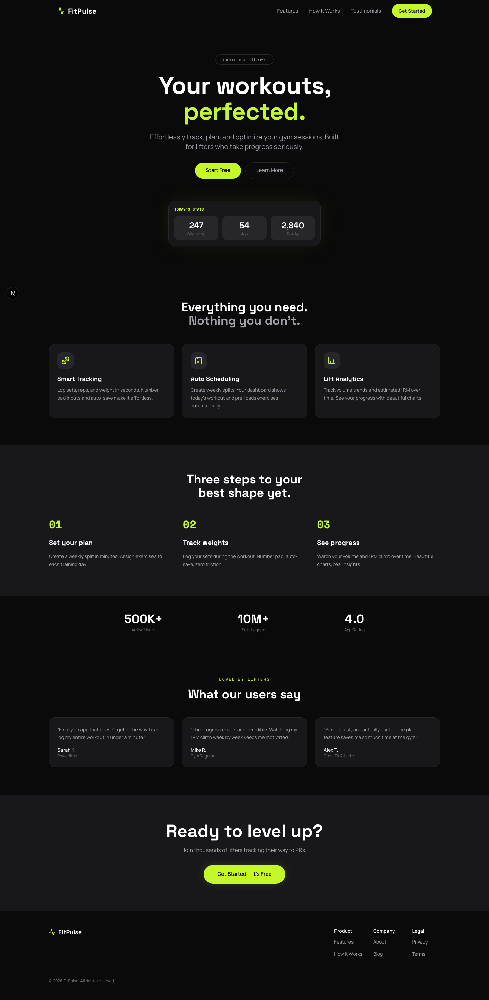

# FitPulse

A gym workout tracking app built for lifters who take progress seriously. Log sets, plan weekly splits, and watch your volume and estimated 1RM climb over time.



## Features

- **Workout Logger** — Log sets, reps, and weight with number pad inputs and auto-save. Optimistic UI with debounced server writes.
- **Weekly Planner** — Create weekly splits, assign exercises to training days, and reorder them. Your dashboard auto-loads today's plan.
- **Progress Charts** — Track weekly volume trends and per-exercise estimated 1RM over time with Recharts.
- **Unit Toggle** — Switch between kg and lbs. Preference saves to your profile and converts weights across the entire app.
- **Leveling System** — Earn levels based on workout count. Badge displays on dashboard and profile.
- **Google OAuth** — One-tap sign in via Supabase Auth.

## Tech Stack

| Layer | Technology |
|-------|-----------|
| Framework | Next.js 16 (App Router, Turbopack) |
| UI | Tailwind CSS v4, shadcn/ui, Lucide icons |
| Auth & DB | Supabase (Auth + PostgreSQL via `@supabase/ssr`) |
| Charts | Recharts |
| Fonts | Space Grotesk (headlines), Manrope (body), Space Mono (labels) |

## Project Structure

```
app/
  (public)/          # Landing page
  (auth)/            # Login + OAuth callback
  dashboard/         # Authenticated app routes
    workout/         # Workout logger
    plan/            # Weekly plan builder
    progress/        # Volume & exercise charts
    profile/         # Profile, best lifts, settings
components/
  landing/           # Hero, features, testimonials, footer
  dashboard/         # Dashboard widgets
  workout/           # Exercise cards, set rows, picker
  plan/              # Day editor
  progress/          # Charts, selectors
  profile/           # Profile header, best lifts, unit toggle
  layout/            # Nav sidebar, mobile nav
  ui/                # shadcn/ui primitives
lib/
  actions/           # Server actions (workouts, plans, profile)
  queries/           # Server-side data fetching
  contexts/          # Unit preference context
  supabase/          # Supabase client/server/middleware
  types/             # TypeScript types matching DB schema
  utils/             # Workout date, unit conversion, leveling
supabase/
  migrations/        # Database schema + RLS policies
  seed.sql           # Exercise seed data
```

## Getting Started

### Prerequisites

- Node.js 18+
- A [Supabase](https://supabase.com) project

### Setup

1. Clone the repo:
   ```bash
   git clone https://github.com/manvendras1ngh/fit-pulse.git
   cd fit-pulse
   ```

2. Install dependencies:
   ```bash
   npm install
   ```

3. Create a `.env.local` file with your Supabase credentials:
   ```
   NEXT_PUBLIC_SUPABASE_URL=your_supabase_url
   NEXT_PUBLIC_SUPABASE_ANON_KEY=your_anon_key
   ```

4. Run the database migrations in your Supabase project (found in `supabase/migrations/`).

5. Start the dev server:
   ```bash
   npm run dev
   ```

6. Open [http://localhost:3000](http://localhost:3000).

## Scripts

| Command | Description |
|---------|-------------|
| `npm run dev` | Start dev server with Turbopack |
| `npm run build` | Production build |
| `npm run start` | Start production server |
| `npm run lint` | Run ESLint |
